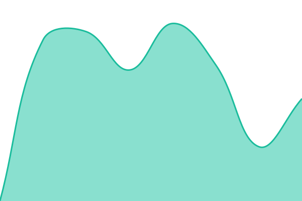
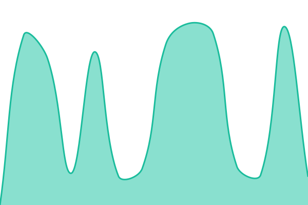
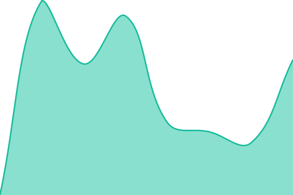

# [📈 Live Status](https://C21coastsh.github.io/ws-ut): <!--live status--> **🟩 All systems operational**

This repository contains the open-source uptime monitor and status page for [C21coastsh](https://C21coastsh.github.io/ws-ut), powered by [Upptime](https://github.com/upptime/upptime).

With [Upptime](https://upptime.js.org), you can get your own unlimited and free uptime monitor and status page, powered entirely by a GitHub repository. We use [Issues](https://github.com/C21coastsh/ws-ut/issues) as incident reports, [Actions](https://github.com/C21coastsh/ws-ut/actions) as uptime monitors, and [Pages](https://C21coastsh.github.io/ws-ut) for the status page.

<!--start: status pages-->
<!-- This summary is generated by Upptime (https://github.com/upptime/upptime) -->
<!-- Do not edit this manually, your changes will be overwritten -->
<!-- prettier-ignore -->
| URL | Status | History | Response Time | Uptime |
| --- | ------ | ------- | ------------- | ------ |
|  [VPMadonna](https://c21coasttocoast.mobi/MADONNASTEINLAGE) | 🟩 Up | [vp-madonna.yml](https://github.com/C21coastsh/ws-ut/commits/HEAD/history/vp-madonna.yml) | 

 657ms
     
 | 

<a href="https://C21coastsh.github.io/ws-ut/history/vp-madonna">100.00%</a>
    

|  [C21CoasttoCoast](https://www.c21coasttocoast.com/) | 🟩 Up | [c21-coastto-coast.yml](https://github.com/C21coastsh/ws-ut/commits/HEAD/history/c21-coastto-coast.yml) | 

 2800ms
     
 | 

<a href="https://C21coastsh.github.io/ws-ut/history/c21-coastto-coast">68.63%</a>
    

|  [Fl Gulf Beach RE](https://www.floridagulfbeachrealty.com/) | 🟩 Up | [fl-gulf-beach-re.yml](https://github.com/C21coastsh/ws-ut/commits/HEAD/history/fl-gulf-beach-re.yml) | 

 644ms
     
 | 

<a href="https://C21coastsh.github.io/ws-ut/history/fl-gulf-beach-re">96.47%</a>
    

<!--end: status pages-->

[**Visit our status website →**](https://C21coastsh.github.io/ws-ut)

## 📄 License

- Powered by: [Upptime](https://github.com/upptime/upptime)
- Code: [MIT](./LICENSE) © [Anand Chowdhary](https://anandchowdhary.com), supported by [Pabio](https://pabio.com)
- Data in the `./history` directory: [Open Database License](https://opendatacommons.org/licenses/odbl/1-0/)
